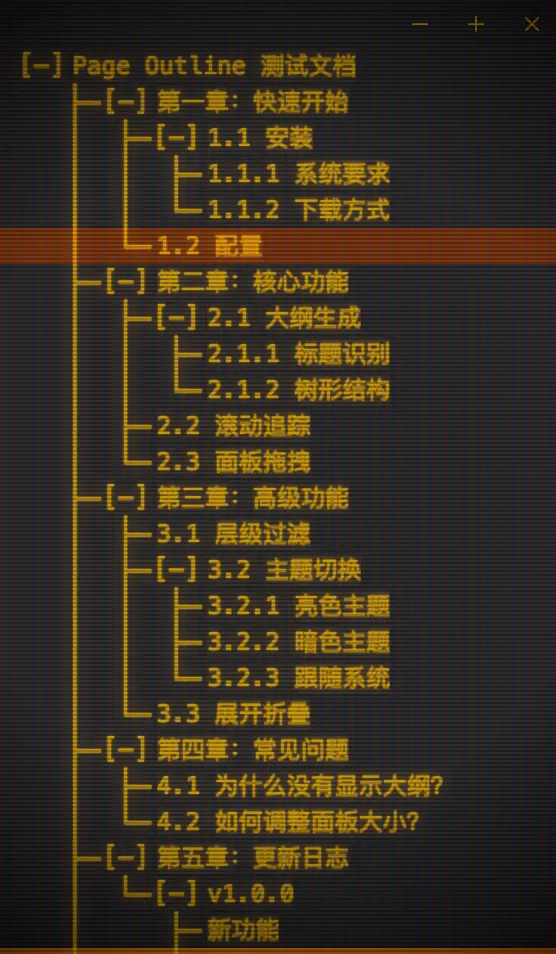

<div align="center">


# Page Outline

**为任何网页自动生成目录大纲**

<!-- 预留图片位置 -->



一键唤起，智能提取，快速导航

[简介](#简介) • [安装](#安装) • [使用](#使用) • [开发](#开发)

</div>

---

## 简介

Page Outline 是一个轻量级浏览器扩展，自动为网页生成结构化目录，提升阅读体验。

### 功能特性

- 自动提取页面标题（H1-H6）生成目录结构
- 支持层级展开/折叠
- 点击目录项跳到对应位置
- 自动高亮当前阅读位置
- 快捷键快速唤起/隐藏面板

## 安装
1. 下载最新版本的 `.zip` 文件
2. 解压到本地目录
3. 打开浏览器扩展管理页面
4. 开启"开发者模式"
5. 点击"加载已解压的扩展程序"，选择解压后的目录

## 使用

### 快捷键
- **macOS**: `Command+Shift+O`

### 操作说明

1. 打开任意网页
2. 使用快捷键或点击扩展图标唤起目录面板
3. 点击目录项快速跳转到对应位置
4. 面板会自动高亮当前阅读的章节

## 开发

### 环境要求

- Node.js >= 18
- pnpm >= 8

### 开发命令

```bash
# 安装依赖
pnpm install

# 开发模式（Chrome）
pnpm dev

# 开发模式（Firefox）
pnpm dev:firefox

# 构建生产版本
pnpm build

# 打包扩展
pnpm zip

# 代码检查
pnpm check

# 代码格式化
pnpm format
```

### 技术栈

- **框架**: WXT - 现代浏览器扩展开发框架
- **UI**: React 19 + Tailwind CSS 4
- **状态管理**: Zustand
- **组件库**: Radix UI
- **语言**: TypeScript

### 项目结构

```
├── entrypoints/       # 扩展入口
│   ├── background.ts  # 后台脚本
│   └── content/       # 内容脚本
├── components/        # React 组件
├── core/             # 核心逻辑
├── store/            # 状态管理
└── lib/              # 工具函数
```
